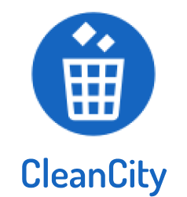

# Table of Contents
<ul>
    <li>
        <a href="#cleancity">Introduction</a>
    </li>
    <li>
        <a href="#Features">Key Features</a>
        <ul><li><a href="#User"></a>User</li>
        <li><a href="#Admin"></a>Admin</li></ul>
    </li>
    <li>
        <a href="#App">Get the App</a>
    </li>
    <li>
        <a href="#Requirement">Requirements</a>
    </li>
    <li>
        <a href="#Build">Build and run the app</a>
    </li>
    <li>
        <a href="#TODOS">ToDos</a>
    </li>
    <li>
        <a href="#Contributors">Contributors</a>
    </li>
</ul>

# cleancity

The outcome of indiscriminate disposal of solid wastes expose human to environmental
degradation such as in flooding, drainage obstruction, widespread of infectious diseases,
cholera, diarrhea typhoid fever, waterway blockage which leads to infestation of flies, ticks and
breeding of mosquitoes that cause malaria, this can go a long way to putting the health of the
community at stake.

CleanCity aims at reducing environmental degradation degradation such as in flooding,
drainage obstruction, the spread of environmental infections such as cholera and malaria. offers
the community with solution to locating closest trash places to dump, provides local councils
with solution which notifies them on trash places within the community that are full and the
route to these places so it can be emptied. This will go a long way to reducing

# Features
<p float="left" >



</p>

- ## User
- Locate all nearest trash places around you
- Show approximate distance from user to a trash place
- Get directions to the trash place.
- show shortest route to full trash place
- ## Admin
- Calculate Trash level
- Notify the Local council with info about trash level
- get Notification of trash places that are full
- Show approximate distance from user to a trash place
- Get directions to the trash place.
- show shortest route to full trash place

# App
You can get the app <a href="#">Here</a>

# Requirements
- google_fonts: ^2.3.1
- google_maps_flutter: ^2.1.2
- location: ^4.3.0
- flutter_polyline_points: ^1.0.0
- geolocator: ^8.0.1
- geoflutterfire: ^3.0.3
- cupertino_icons: ^1.0.2
- cloud_firestore: ^2.5.1
- flutter_spinkit: ^5.1.0
- flutter_svg: ^0.19.1
- shared_preferences: ^2.0.5

# Build
# Build and Run the app

- Open the project on Android Studio or intellij.
- Get your Google Maps API key. For Android, follow instructions here
- Add the API key to your Flutter app in the application manifest (android/app/src/main/AndroidManifest.xml), as follows:
```
<application
    <meta-data android:name="com.google.android.geo.API_KEY"
            android:value="YOUR API KEY" />

```
- Run the code on Android studio and view the app on your emulator of choice or mobile device. You can also run the app from the terminal using  
```
flutter run 
```

## TODOS
- Improve the User Interface
- Integrate GPS services
- Integrate more locations
- Add Sensitization messages on home screen.
## Contributors
- Lukong Anne M.        |<annemachinda@gmail.com>
- Nfon Andrew           |<nfonandrew73@gmail.com> 
- Nyong Godwill Nkwain  |<nyonggodwill11@gmail.com>
- Ngwa Jude             |<ngwa.jude@gmail.com>